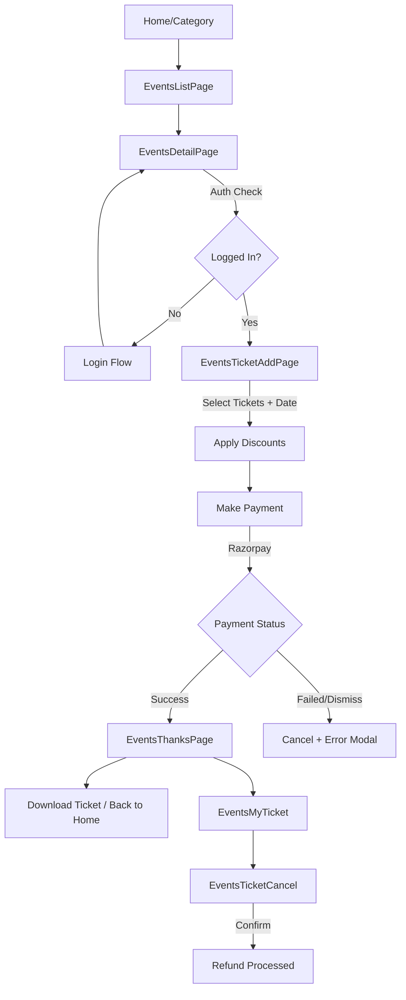

# Events Category Flow - Complete Documentation

## Overview

The **Events Category** module handles event browsing, ticket booking, payment processing, and booking management. It includes 7 pages, 6 components, a Redux slice for state management, and integrates with Razorpay for payments.

---

## 📁 File Structure

```
src/containers/events-category/
├── assets/
│   ├── lottie/            # Animations (christmas, floating, snowfall)
│   ├── music.png, mic.png, snowman.png  # Category images
├── components/
│   ├── BookingFailedModal.jsx    # Error modal for booking failures
│   ├── EventDetailCard.jsx       # Reusable event summary card with QR
│   ├── HeaderAnimation.jsx/css   # Animated header with Lottie
│   ├── TermsAndConditions.jsx    # Policy modal
│   └── TicketPdf.jsx             # PDF template for ticket download
├── pages/
│   ├── EventsListPage.jsx        # Main events listing
│   ├── EventsDetailPage.jsx      # Single event details + ticket selection
│   ├── EventsTicketAddPage.jsx   # Booking creation + payment
│   ├── EventsThanksPage.jsx      # Booking success confirmation
│   ├── EventsMyTicket.jsx        # View booked ticket
│   ├── EventTicketDetail.jsx     # Booking details (no QR)
│   └── EventsTicketCancel.jsx    # Ticket cancellation flow
├── route.jsx                     # Route definitions
├── slice.js                      # Redux slice
└── utils.js                      # Utility functions
```

---

## 🛤️ Routes

| Route                             | Component               | Description                     |
|-----------------------------------|-------------------------|---------------------------------|
| `/events`                         | Redirect → `/events/7`  | Default redirect                |
| `/events/:category_id`            | `EventsListPage`        | List events by category         |
| `/events/detail/:service_id`      | `EventsDetailPage`      | Event details + ticket variants |
| `/events/add-ticket`              | `EventsTicketAddPage`   | Ticket selection + payment      |
| `/events/thanks`                  | `EventsThanksPage`      | Booking confirmation            |
| `/events/my-ticket/:booking_id`   | `EventsMyTicket`        | View ticket + cancel option     |
| `/events/booking-detail/:booking_id` | `EventTicketDetail`  | Booking details (past bookings) |
| `/events/cancel-booking`          | `EventsTicketCancel`    | Cancel tickets                  |

---

## 🗃️ Redux Slice (`slice.js`)

```javascript
// State Structure
{
  selectedEvent: null,    // Currently selected event with enriched data
  selectedTicket: null,   // Selected ticket variant
  bookedData: null        // Booking response data after payment
}

// Actions
setSelectedEvent(payload)     // Store event details
setSelectedTicket(payload)    // Store selected ticket variant
setEventBookedData(payload)   // Store booking response
resetBookingData()            // Clear all booking state
```

---

## 📄 Page-by-Page Flow

### 1. EventsListPage (`/events/:category_id`)

**Purpose**: Display all events for a category with filtering options.

**Data Flow**:
1. Fetch events via `getAllServices(category_id)` API
2. Enrich events with parsed attributes:
   - `event_date` → eventDate (supports date ranges)
   - `event_time` → eventTime
   - `event_location` → eventLocation (JSON parsed)
   - Price range from variants (displayPrice, overridePrice)
   - Distance calculation from user location
3. Apply date filters (Today, Tomorrow, This Weekend)

**Key Features**:
- Hero banner slider (top 5 events sorted by date)
- Featured events horizontal scroll
- Explore categories (Music, Comedy, New Year)
- All events grid with filter pills
- Responsive design (mobile + desktop)

**Navigation**: Click event → `EventsDetailPage`

---

### 2. EventsDetailPage (`/events/detail/:service_id`)

**Purpose**: Show event details and available ticket variants.

**Data Flow**:
1. Fetch event via `getServiceById(service_id)` API
2. Fetch category config via `getCategoryById(categoryId)` for KCoin settings
3. Parse attributes: date, time, description, location, files (images)
4. Calculate price ranges and discounts from variants

**Key Features**:
- Image carousel with auto-play
- Event info: date, time, price range, location
- Description with "Read more" expand
- Available tickets with pricing, status badges (Sold Out, Fast Filling)
- Share modal integration

**Navigation**: Click "Book Now" → Authentication check → `EventsTicketAddPage`

**Redux Actions**:
```javascript
dispatch(setSelectedTicket(ticket));
dispatch(setSelectedEvent({
  ...processedEvent,
  isKcoinEnabled, isKcoinUsesEnabled, isKcoinEarningEnabled,
  kcoinMinimumOrderValue, kcoinMaximumOrderPercentageRedem, kcoinToCurrency
}));
```

---

### 3. EventsTicketAddPage (`/events/add-ticket`)

**Purpose**: Complete ticket selection, apply discounts, and process payment.

**Data Flow**:
1. Read `selectedEvent` and `selectedTicket` from Redux
2. Initialize ticket counts (pre-select the clicked ticket)
3. Filter sold-out tickets from available variants
4. Fetch platform fee via `getCategoryById`
5. Fetch user wallet via `getUsersWallet`

**Key Features**:
- **Ticket Selector**: Add/remove tickets (max 10, limited by available qty)
- **Date Selector**: Pick from event date range (past dates disabled)
- **Discount Drawer**: Apply promo codes via `getApplicableDiscounts`
- **KCoin Toggle**: Use loyalty coins for discount
- **Price Summary**: Subtotal, discount, KCoin discount, platform fee, total

**Booking Creation** (`makeBooking`):
```javascript
const response = await createBooking({
  categoryId,
  providerId,
  bookingType: "store",
  scheduledTime: mergeDateTime(selectedDate, eventTime),
  notes: "",
  kcoinAmountToUse,
  paymentMode: "online",
  services: [{
    providerServiceId: selectedEvent.id,
    quantity: 1,
    variants: [{ spServiceVariantId, qty }]
  }],
  attributes: [...],
  discountCode,
  cities
});
```

**Payment Flow** (`handlePay`):
1. Call `makeBooking()` → Get booking with Razorpay order
2. `initiatePayment(bookingResponse.data.payment, options)` → Open Razorpay modal
3. On success: `verifyPayment(razorpayResponse)` → Navigate to thanks page
4. On dismiss/failure: `cancelBookingById()` → Show error modal

---

### 4. EventsThanksPage (`/events/thanks`)

**Purpose**: Show booking confirmation with QR code and download option.

**Data Flow**:
1. Read `bookedData` and `selectedEvent` from Redux
2. Generate QR code using `qrcode.toDataURL(bookingId)`
3. Prepare summary: image, name, bookingId, location, dateTime, tickets, total

**Key Features**:
- Success animation video
- `EventDetailCard` with QR code
- Download ticket as PDF (uses `html2canvas` + `jsPDF`)
- "Back to Home" button

---

### 5. EventsMyTicket (`/events/my-ticket/:booking_id`)

**Purpose**: View a booked ticket with cancel option.

**Data Flow**:
1. Fetch booking via `getBookingById(booking_id)` API
2. Store in Redux: `dispatch(setEventBookedData(response.data))`
3. Generate QR code from booking ID

**Key Features**:
- `EventDetailCard` with full booking details
- Download ticket PDF (web only)
- Cancel ticket button → `EventsTicketCancel`

---

### 6. EventTicketDetail (`/events/booking-detail/:booking_id`)

**Purpose**: View booking details without QR (for past bookings).

**Data Flow**: Same as `EventsMyTicket` but with `showQR={false}`

---

### 7. EventsTicketCancel (`/events/cancel-booking`)

**Purpose**: Cancel tickets (partial or full) with refund calculation.

**Data Flow**:
1. Read `bookedData` from Redux
2. Initialize ticket counts from booked variants
3. Track changes: `differenceItems = previousCounts - selectedCounts`
4. Calculate refund total

**Cancellation Flow**:
```javascript
// Full cancellation
if (isCompleteCancellation) {
  await cancelBookingById(bookedData.id, { reason });
}
// Partial cancellation
else {
  await cancelBookingById(bookedData.id, {
    reason,
    serviceVariants: [{ bookingServiceVariantId, qty }]
  });
}
```

**Key Features**:
- Event summary card
- Ticket count adjustment (+/-)
- Reason dropdown (Schedule Conflict, Emergency, Weather, etc.)
- Refund calculation
- Confirmation checkbox for policy acceptance

---

## 🔌 API Integration

### Endpoints Used

| API Function           | Endpoint              | Usage                           |
|------------------------|-----------------------|---------------------------------|
| `getAllServices`       | GET `/services`       | Fetch events by category        |
| `getServiceById`       | GET `/services/:id`   | Fetch single event details      |
| `getCategoryById`      | GET `/categories/:id` | Get category config (fees, KCoin)|
| `createBooking`        | POST `/bookings`      | Create booking with payment     |
| `getBookingById`       | GET `/bookings/:id`   | Fetch booking details           |
| `cancelBookingById`    | DELETE `/bookings/:id`| Cancel booking (full/partial)   |
| `getUsersWallet`       | GET `/wallets`        | Get user KCoin balance          |
| `getApplicableDiscounts`| POST `/discounts/applicable` | Get available discounts |
| `verifyPayment`        | POST `/payments/verify` | Verify Razorpay payment       |

---

## 💳 Payment Integration (Razorpay)

**Hook**: `useRazorpay()` from `paymentService.js`

**Flow**:
```
createBooking() → Razorpay Order Created → initiatePayment() → Razorpay Modal
    ↓
[User Pays]
    ↓
Success: verifyPayment() → Navigate to /events/thanks
Dismiss: cancelBookingById() → Show error modal
Failure: Show error message
```

**Verify Payment Payload**:
```javascript
{
  razorpay_order_id: "...",
  razorpay_payment_id: "...",
  razorpay_signature: "..."
}
```

---

## 🧩 Reusable Components

| Component                | Purpose                                          |
|--------------------------|--------------------------------------------------|
| `EventDetailCard`        | Display booking summary with QR, location, price |
| `TicketPdf`              | PDF template for downloadable tickets            |
| `BookingFailedModal`     | Error modal for booking/payment failures         |
| `TermsAndConditionsModal`| Display cancellation policy or T&C               |
| `HeaderAnimation`        | Lottie animation in header                       |

---

## 🔄 Complete User Journey



---

## 📝 Key Data Structures

### Enriched Event Object
```javascript
{
  ...rawEvent,
  eventDate: ["12-12-2025", "13-12-2025", ...],  // Expanded date array
  eventTime: "10:00 AM, 06:00 PM",
  eventDescription: "...",
  eventLocation: { latitude, longitude, fullManualAddress },
  eventFiles: ["url1.jpg", "url2.jpg"],
  eventDistance: 5.2,  // km from user
  eventPriceRange: {
    min: { displayPrice: 500, overridePrice: 700 },
    max: { displayPrice: 2000, overridePrice: 2500 }
  },
  discountPercent: 28,
  maxDiscount: 200,
  // KCoin settings (from category)
  isKcoinEnabled, isKcoinUsesEnabled, isKcoinEarningEnabled,
  kcoinMinimumOrderValue, kcoinMaximumOrderPercentageRedem, kcoinToCurrency
}
```

### Booking Request Payload
```javascript
{
  categoryId: 7,
  providerId: 123,
  bookingType: "store",
  scheduledTime: "2025-12-15T10:00:00.000Z",
  notes: "",
  kcoinAmountToUse: 50,
  paymentMode: "online",
  services: [{
    providerServiceId: 456,
    quantity: 1,
    variants: [
      { spServiceVariantId: "789", qty: 2 },
      { spServiceVariantId: "790", qty: 1 }
    ]
  }],
  attributes: [{ categoryAttributeId: 1, value: "..." }],
  discountCode: "SAVE10",
  cities: ["Bikaner"]
}
```
